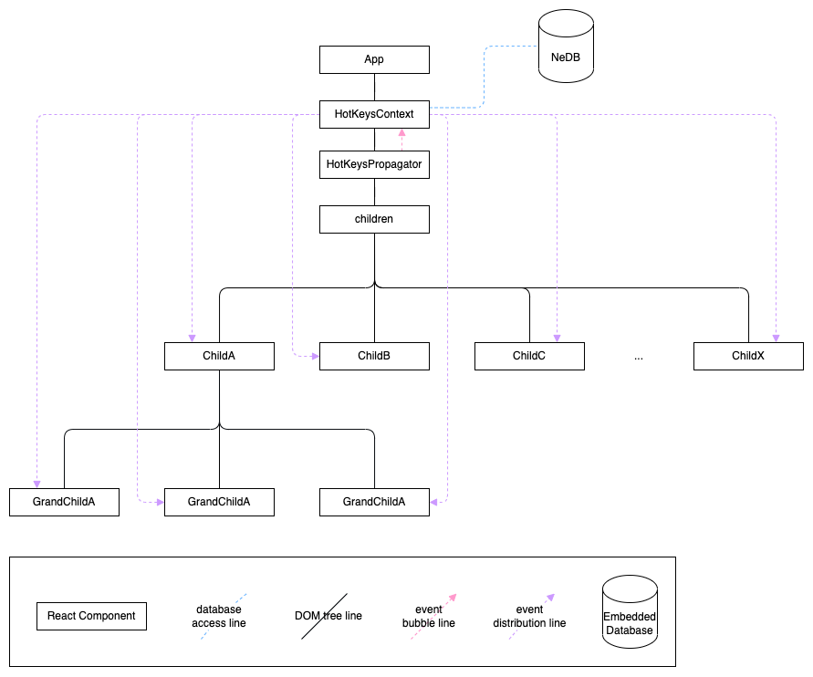

# Insomnia Desktop Hotkey Event Delegation
* Status: [drafted]

## Table of Content
* [Insomnia Desktop Hotkey Event Delegation](#insomnia-desktop-hotkey-event-delegation)
* [Table of Content](#table-of-content)
  * [Context and Problem Statement](#context-and-problem-statement)
    * [Context](#context)
    * [Problem Statement](#problem-statement)
  * [Decision Drivers](#decision-drivers)
  * [Non-goals](#non-goals)
  * [Considered Options](#considered-options)
  * [Decision Outcome](#decision-outcome)
    * [Positive Consequences](#positive-consequences)
    * [Negative Consequences](#negative-consequences)
    * [Rollout](#positive-consequences)
  * [Pros and Cons of the Options](#pros-and-cons-of-the-options)
    * [Option 1](#option-1)
    * [Option 2](#option-2)
    * [Option 3](#option-3)
  * [Links](#links)

## Context and Problem Statement
### Context
Insomnia Desktop client supports hotkey commands to control the behaviors of the applications listed out here. Currently, the hotkey operation works by,

1. propagate the keydown event from [<KeyDownBinder />](https://github.com/Kong/insomnia/blob/40af38c3b9711ff6ba4ab647be08765a0aeefeab/packages/insomnia/src/ui/components/keydown-binder.ts#L17) to the destination component with an option to stop the propagation
2. [read](https://github.com/Kong/insomnia/blob/40af38c3b9711ff6ba4ab647be08765a0aeefeab/packages/insomnia/src/common/hotkeys-listener.ts#L35) the [NeDB](https://github.com/louischatriot/nedb) database to check if the key combination exists as a registered hotkey (every key stroke triggers this)
3. execute the callback function to act on the hotkey command in the destination component

### Problem Statement

The currrent pattern may work generally fine when the keydown event scope is not limited. However, it creates complications when event propagation is stopped and event is scoped to a child DOM tree.

This [issue]((https://github.com/Kong/insomnia/issues?q=is%3Aissue+hotkey+is%3Aclosed+bug+)) exemplifies such complication. As issues have appeared several times already, it may need another attention to revisit the current hotkey operation flow.

## Decision Drivers

* The Keyboard, ‘keydown’, event bubble/propagation needs to be completely separated from hotkey command event propagation
* The hotkey command event needs to be distributed from the top to the bottom and selectively listened in where a hotkey operation actually targets
* NeDB database should be read only once unless its modification happens
* Slight performance enhancement can be expected as the current implementation registers keydown event listeners to several DOM elements and reads NeDB every key stroke

## Non-goal
* can help converting class components into functional components, but that is not the goal for this work.
* does not include enhancing dropdown or modal functionality

## Considered Options
* option 1 - use of pub/sub pattern with [EventEmitter](https://nodejs.org/api/events.html#class-eventemitter) and [React Context API](https://reactjs.org/docs/context.html) in the top to flush out hotkey event from top to bottom
* option 2 - variation of option 1 with [RxJS](https://rxjs.dev/) [Subject](https://rxjs.dev/api/index/class/Subject) instead of the native EventEmitter
* option 3 - keep the existing pattern and fix it up

## Decision Outcome
Chosen option: "option 1", because
* It only requires one keydown event listener to be attached to the document.body, removing all unnecessary event listeners created by KeyDownBinder instances
* It binds the event delegation through native Node API and React API
* It only reads NeDB once when initialized but reflects on the change flush (for instance, when user updates the hotkey combination)
* It allows individual hotkey target component to stay “reactive” to the hotkey command from the top and execute a callback accordingly

### Positive Consequences
* enforces top-to-bottom paradigm
* opens a path to enable conditional hotkey operation
* requires refactoring of existing class components into functional components if not now, at least rollout plan to do so
* requires higher test coverage on each hotkey command
* increase the performance of the application slightly by having less event listeners and executing database reads on every stroke

### Negative Consequences
* requires more time in development; higher test coverage before implementing this option and more refactoring of React components
* leaves workaround pattern of wrapping a class component with react component to achieve the same imperative operation to control child component using ref objects
* requires strong willingness and time allocation to clean up workaround pattern
* despite successful removal of execessive DOM event listeners, it adds several EventEmitter listeners. However, this implementation only requires one keydown listener to one DOM element and EventEmitter listeners are registered to the same source, which may make a difference

### Rollout
Phase | Execution
--- | ---
1 | Add Playwright tests for each hot key operation
2 | Add HotKeysContext, HotKeysPropagator, HotKeysExecutor and hooks for replacing the KeyDownBinder and executeCallback
3 | Migrate all the functional component workaround for pure component classes and remove HotKeysExecutor and remove the noise

## Pros and Cons of the Options
### Option 1
This option requires EventEmitter and React Context implementation. 

* Good, because it does not require any external library
* Good, because it centralizes the keydown event to document.body, which flushes out a command throughout the application via HotKeysContext subscription; top to bottom
* Bad, because it requires extra effort to write event subscription pipes as its native
* Bad, because it requires function component pattern and the patterns of current codebase needs some workaround for it

Option 2
The exact same implementation as option 1 but instead of using EventEmitter, it would use RxJS Subject

* Good, because rxjs offers very powerful operators in the pipe of event stream
* ~~Bad, because it requires an external library~~ (it's already included)
* Bad, because it adds up learning curve for those who've never used it before

Option 3
We don't redesign the flow and keeps the pattern of KeyDownBinder and calling executeHotKey function that reads database on every key stroke. We just spend a lot of time fixing it whenever issue appears again.

* Good, because immediate cost may be low
* Bad, because it somewhat blocks tech debt effort because of how KeyDownBinder has been used to trigger hotkey callback imperatively
* Bad, because it still hangs event listeners from all KeyDownBinder instances, which are rendered through components that are unnecessarily mounted. For instance, Modal, Dropdown don't need to be mounted when they are not open but they are. This includes KeyDownBinder, which means keydown event listeners are registered unnecessarily; contributing to draining overall app performance.

## Links
* [Link type] [Link to ADR] <!-- example: Refined by [ADR-0005](0005-example.md) -->

<!-- markdownlint-disable-file MD013 -->

