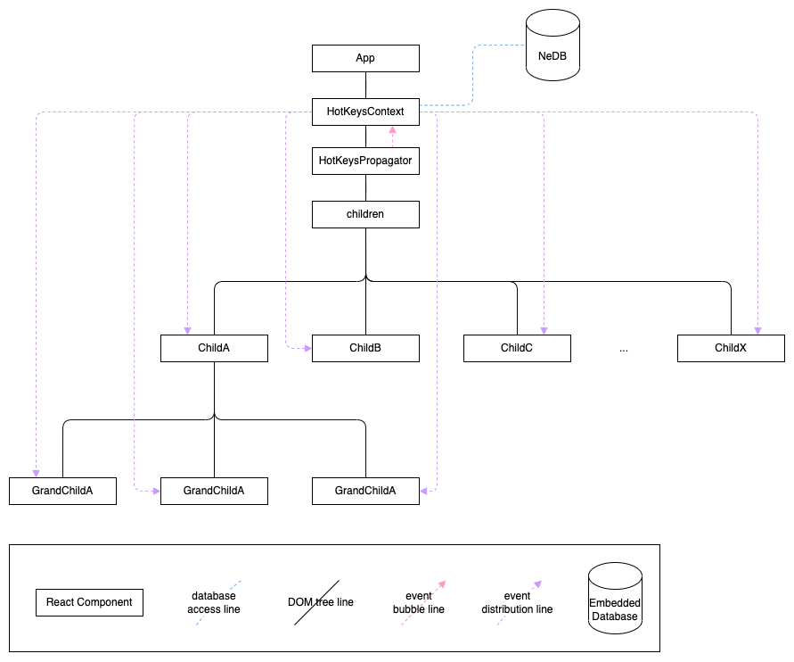

# Insomnia Desktop Hotkey Event Delegation
* Status: [drafted]

## Context and Problem Statement

### Context
Insomnia Desktop client supports hotkey commands to control the behaviors of the applications listed out here. Currently, the hotkey operation works by,

1. propagate the keydown event from <KeyDownBinder /> to the destination component
2. read the NeDB database to check if the key combination exists as a registered hotkey (every key stroke triggers this)
3. execute the callback function to act on the hotkey command in the destination component


It is observed that this way of flow is directed from the bottom to top, which goes against the react principle; top-to-bottom and declarative rendering.

More importantly, this pattern has created complications when any scoping of a keydown event is required to control a specific component. For instance, the event stream is blocked in the RequestUrlBar component tree to bubble form submission events by pressing the “Enter” key due to scoping.
Problem Statement

The bottom-to-top way of current hotkey operation flow has created complications and repeated bugs, and this may need another attention to revisit the current hotkey operation flow.

## Decision Drivers

* The Keyboard, ‘keydown’, event bubble/propagation needs to be completely separated from hotkey command event propagation
* The hotkey command event needs to be distributed from the top to the bottom and selectively listened in where a hotkey operation actually targets
* NeDB database should be read only once unless its modification happens

## Considered Options
* option 1 - use of pub/sub pattern with EventEmitter and React Context AP in the top to flush out hotkey event from top to bottom
* option 2 - variation of option 1 with RxJS Subject instead of the native EventEmitter
* option 3 - keep the existing pattern and fix it up

## Decision Outcome
Chosen option: "option 1", because
* It only requires one keydown event listener to be attached to the document.body, removing all unnecessary event listeners created by KeyDownBinder instances
* It binds the event delegation through native Node API and React API
* It only reads NeDB once when initialized but reflects on the change flush (for instance, when user updates the hotkey combination)
* It allows individual hotkey target component to stay “reactive” to the hotkey command from the top and execute a callback accordingly

### Positive Consequences
* enforces top-to-bottom paradigm
* opens a path to enable conditional hotkey operation
* requires refactoring of existing class components into functional components if not now, at least rollout plan to do so
* requires higher test coverage on each hotkey command
* increase the performance of the application slightly by having less event listeners and executing database reads on every stroke

### Negative Consequences
* requires more time in development; higher test coverage before implementing this option and more refactoring of React components
* leaves workaround pattern of wrapping a class component with react component to achieve the same imperative operation to control child component using ref objects
* requires strong willingness and time allocation to clean up workaround pattern

## Pros and Cons of the Options
### Option 1
This option requires EventEmitter and React Context implementation. 


EventEmitter and React Context
```js

const HOTKEY_EVENT_TAG = 'HOTKEY_EVENT_TAG';
const hotkeyEvent = new EventEmitter();

interface HotKeyCommand {
  hotkeyId: string;
  conditions?: string[];
}
export const HotKeysContext = createContext<UseHotKeysContext>({} as UseHotKeysContext);
export const HotKeysProvider: FunctionComponent<{ children: ReactNode}> = ({ children }) => {
  const { hotKeyRegistry } = useSelector(selectSettings);

  const sendHotkeyEvent = useCallback((hotkeyId: string, targetIdentifier?: string) => {
    hotkeyEvent.emit(HOTKEY_EVENT_TAG, { hotkeyId, targetIdentifier });
  }, []);

  const checkIfHotKeyPressed = useCallback((e: KeyboardEvent, definitions: Record<string, HotKeyDefinition>): null | HotKeyDefinition => {
    /**
     * this is a copy paste from the existing function with slight modification
    */
    function pressedHotKey(event: KeyboardEvent, definition: HotKeyDefinition): boolean {
      const pressedKeyComb: KeyCombination = {
        ctrl: event.ctrlKey,
        alt: event.altKey,
        shift: event.shiftKey,
        meta: event.metaKey,
        /**
         * TODO: keyCode is deprecated. we may refactor this in the soon future but this is out of scope for this work.
         * */
        keyCode: event.keyCode,
      };

      const keyCombList = getPlatformKeyCombinations(hotKeyRegistry[definition.id]);
      for (const keyComb of keyCombList) {
        if (areSameKeyCombinations(pressedKeyComb, keyComb)) {
          return true;
        }
      }

      return false;
    }

    const pressed = Object.values(definitions).find(def => pressedHotKey(e, def));
    if (!pressed) {
      return null;
    }

    return pressed;
  }, [hotKeyRegistry]);

  return (
    <HotKeysContext.Provider value={{ sendHotkeyEvent, checkIfHotKeyPressed }}>{children}</HotKeysContext.Provider>
  );
};

```
GlobalHotKeysBinder
```js
const GlobalHotKeysBinder: FunctionComponent<{ children: ReactNode }> = ({ children }) => {
  const { sendHotkeyEvent, checkIfHotKeyPressed } = useContext(HotKeysContext);

  useEffect(() => {
    const body = document.body;
    const listener = async (e: KeyboardEvent) => {
      const result = await checkIfHotKeyPressed(e, hotKeyRefs);
      if (!result) {
        return;
      }

      sendHotkeyEvent(result.id);
    };

    body.addEventListener('keydown', listener);
    return () => body.removeEventListener('keydown', listener);
  }, [sendHotkeyEvent, checkIfHotKeyPressed]);

  return <>{children}</>;
};
```
how it can be used.
```js
const TargetComponent1: FunctionComponent<Props> = props => {
  const handleHotKey = useCallback((e: HotKeyEvent) => {
    if (e.hotkeyId === hotKeyRefs.GRAPHQL_EXPLORER_FOCUS_FILTER.id) {
      // doSomething
    }
  }, []);

  useHotKeysSubscriber(handleHotKey);

  return <div>Target Component 1</div>
};

const App: FunctionComponent = () => {
  return (
      <HotKeysProvider>
        <GlobalHotKeysBinder>
          <TargetComponent1 />
          <SomeWrapper>
            <TargetComponent2 />
          </SomeWrapper>
        </GlobalHotKeysBinder>
      </HotKeysProvider>
  );
};
```

* Good, because [argument a]
* Good, because [argument b]
* Bad, because [argument c]
* … <!-- numbers of pros and cons can vary -->
Option 2

[example | description | pointer to more information | …] <!-- optional -->

* Good, because [argument a]
* Good, because [argument b]
* Bad, because [argument c]
* … <!-- numbers of pros and cons can vary -->
Option 3
[example | description | pointer to more information | …] <!-- optional -->

* Good, because [argument a]
* Good, because [argument b]
* Bad, because [argument c]
* … <!-- numbers of pros and cons can vary -->
Links
* [Link type] [Link to ADR] <!-- example: Refined by [ADR-0005](0005-example.md) -->
* … <!-- numbers of links can vary -->

<!-- markdownlint-disable-file MD013 -->


