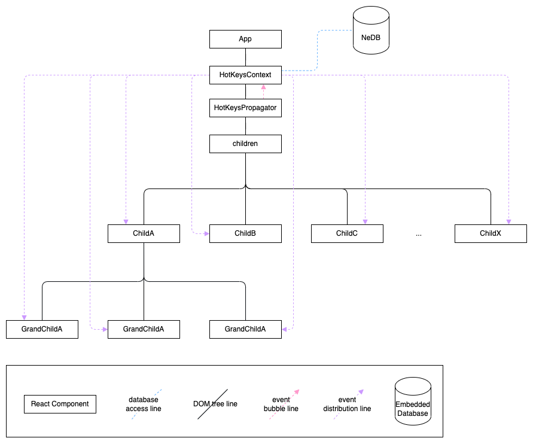

# [Spec] Insomnia Desktop Hotkey Event Delegation
* Status: [drafted]

## Table of Content
* [[Spec] Insomnia Desktop Hotkey Event Delegation](#spec-insomnia-desktop-hotkey-event-delegation)
* [Table of Content](#table-of-content)
  * [Overview](#overview)
    * [Summary](#summary)
    * [High Level Diagram](#high-level-diagram)
  * [Implementation](#implementation)
    * [DOM Event Capturing](#dom-event-capturing)
    * [Custom Event Propagation](#custom-event-propagation)
    * [Custom Event Listening](#custom-event-listening)
        * [Single Hotkey](#single-hotkey)
        * [Multiple Hotkeys](#multiple-hotkeys)
  * [Rollout Plan](#rollout-plan)
    * [Phase 1](#phase-1---add-playwright-tests-for-each-hot-key-operation)
    * [Phase 2](phase-2---add-hotkeyscontext-hotkeyspropagator-hotkeysexecutor-and-hooks-for-replacing-the-keydownbinder-and-executecallback)
    * [Phase 3](#phase-3---migrate-all-the-functional-component-workaround-for-pure-component-classes-and-remove-hotkeysexecutor-and-remove-the-noise)

## Overview

### Summary
This design is to allow the Insomnia Client to propagate a custom event after keydown event is captured in the document.body and to distribute the custom event from *top to bottom* for hotkey execution in any component that needs to act on it.

### High Level Diagram


## Implementation

This implementation may need three components to achieve the custom event distribution; DOM event capturing, custom event propagation, and its listening, somewhat similar to the DOM event phases.

It was intended to use React Context API to enforce top to bottom data flush.

### DOM Event Capturing
This part is to capture the keydown event globally (or to some degree of top level). It seems necessary to keep a DOM keydown listener, but let's limit to one instead of having multiple unlike the current implementation.

A React component, ```<HotKeysPropagator />```, adds keydown event listener to body (or we can add it to the top DOM element of the node instead).

As the name of the component describes, this propagates a hotkey custom event through its Context.

```js
<HotKeysProvider>
  <HotKeysPropagator>
    {children}
  </HotKeysPropagator>
</HotKeysProvider>
```

### Custom Event Propagation
```<HotKeysProvider />``` creates an EventEmitter, ```$hotkeyChannel``` and provides a channel to publish and subscribe this emitter. This Context provides two methods for its consumer to use; checkHotkeyPressed and sendHotkeyCommand.

Methods | Description
--- | ---
checkHotkeyPressed | checks if the pressed key combination is valid
sendHotkeyCommand | emits a custom event with hotkey id (possibly can add conditions here too) via ```EventEmitter``` that is created in ```<HotKeysContext />```

However, note that the event emitter will not be directly exposed through ```useContext(HotKeysContext)``` in order to control event emitting only via the Context method.

### Custom Event Listening
Now, let's hook up the components with hotkeys. It seems that in the current implementation, there are two use cases of hotkey executions; single hotkey per component or multiple hotkeys in a component.

To make it consistent with Context and consumable, custom hooks are created to listen to the custom event and executes the hotkey callbacks.
#### Single Hotkey
A single component is listening to a single hot key. This has been the primary pattern observed like the below:

```js
class SomeExampleComponent extends PureComponent<Props, State> {
  _handleKeyDown(e) {
    e.stopPropagation();
    executeHotKey(event, hotKeyRefs.REQUEST_FOCUS_URL, () => {
      // Do something like the below:
      // this._input?.focus();
      // this._input?.selectAll();
    });
  }

  render () {
    return (
      <KeyDownBinder onKeyDown={this._handleKeyDown}>
        <div>actual component tree comes here</div>
      </KeyDownBinder>
    );
  }
}
```

Instead of the above, we can do something like the following:
```js
const SomeExampleComponent: FunctionComponent<Props> = () => {
  useHotKeyEffect(() => {
    // Do some stuff here instead
  }, hotKeyRefs.REQUEST_FOCUS_URL.id);

  return <div>actual component tree comes here</div>;
};
```

#### Multiple Hotkeys
Currently, ```<App />``` component handles several hotkey executions with another ```<KeydownBinder />``` with its callback like the following:
```js
class App extends PureComponent<Props, State> {
  async componentDidMount() {
    this._setGlobalKeyMap();
  }

  _setGlobalKeyMap() {
    this._globalKeyMap = [
      [
          hotKeyRefs.PREFERENCES_SHOW_GENERAL,
          () => {
          App._handleShowSettingsModal();
          },
      ],
      [
        hotKeyRefs.PREFERENCES_SHOW_KEYBOARD_SHORTCUTS,
        () => {
          App._handleShowSettingsModal(TAB_INDEX_SHORTCUTS);
        },
      ],
      // ...other iterms continue
    ]
  }

  _handleKeyDown() {
    for (const [definition, callback] of this._globalKeyMap) {
      executeHotKey(event, definition, callback);
    }
  }

  render() {
    return (
      <KeydownBinder onKeydown={this._handleKeyDown}>
        <GrpcProvider>
          <NunjucksEnabledProvider>
            <AppHooks />
            <div>actual app content</div>
          </NunjucksEnabledProvider>
        </GrpcProvider>
      </KeydownBinder>
    );
  }
}
```


This pattern requires us to handle multiple hot keys in a single component, which can be handled like the below:
```ts
const App: FunctionComponent<Props> = ({ children }) => {
  const handleHotkeyByCase = (hotkeyId: string) => {
    switch(hotkey) {
      case hotKeyRefs.PREFERENCES_SHOW_GENERAL.id: {
        // do something
        return;
      }

      case hotKeyRefs.PREFERENCES_SHOW_KEYBOARD_SHORTCUTS.id: {
        // do something
        return;
      }
    }
  };

  useHotKeysEffect((hotkeyId: string) => {
    handleHotkeyByCase(hotkeyId);
  }, [
    hotKeyRefs.PREFERENCES_SHOW_GENERAL.id,
    hotKeyRefs.PREFERENCES_SHOW_KEYBOARD_SHORTCUTS.id
  ]);

  return (
    <GrpcProvider>
      <NunjucksEnabledProvider>
        <AppHooks />
        <div>actual app content</div>
      </NunjucksEnabledProvider>
    </GrpcProvider>
  );
};
```

However, the above implementation is not immediately possible due to the tech debt, so workaround needs to be done with rollout plans.

## Rollout Plan
### Phase 1 - Add Playwright tests for each hot key operation
It is critical to keep the state of our current Insomnia as is unless improved. Therefore, it's important to increase test coverage in every hotkey execution case to detect if there will be any bug arisen from refactoring.

### Phase 2 - Add HotKeysContext, HotKeysPropagator, HotKeysExecutor and hooks for replacing the KeyDownBinder and executeCallback
Once we have the test coverage, we will implement HotKeysContext and its modular parts (HotKeysPropagator and hooks). However, this is not immediately possible without workaround solutions due to the prevalent paterns of using PureComponent as Class components.

The proposal for workaround would be to create wrapper Functional components around the pure compnents.

* for multiple hotkeys, we would need to create something like ```<HotKeysExecutor />``` to wrap the chidlren within ```<App />``` to invoke multiple hot key callbacks in functional manner.
```ts
type KeyOfHotKeys = keyof typeof hotKeyRefs;
type HotKeysExecutionMap = Map<KeyOfHotKeys, () => void>;
interface Props {
  children?: ReactNode;
  keysMap: HotKeysExecutionMap;
}

// TODO: This component should be removed when the app component becomes a functional component.
const HotkeysExecutor: FunctionComponent<Props> = ({ children, keysMap }) => {
  useHotKeysEffect((hotkeyId: string) => {
    keysMap.get(hotkeyId)?.();
  }, [
    hotKeyRefs.PREFERENCES_SHOW_GENERAL.id,
    hotKeyRefs.PREFERENCES_SHOW_KEYBOARD_SHORTCUTS.id
  ]);

  return <>{children}</>;
};

class App extends PureComponent<Props, State> {
  async componentDidMount() {
    this._setGlobalKeyMap();
  }

  _setGlobalKeyMap() {
    const keysMap = new Map([
      [
        hotKeyRefs.PREFERENCES_SHOW_GENERAL.id,
        () => {
          App._handleShowSettingsModal();
        },
      ],
      [
        hotKeyRefs.PREFERENCES_SHOW_KEYBOARD_SHORTCUTS.id,
        () => {
          App._handleShowSettingsModal(TAB_INDEX_SHORTCUTS);
        },
      ],
      // ...other keys continue here
    ]);

    this.setState({ keysMap });
  }

  render() {
    return (
      <HotKeysProvider hotKeyRegistry={this.props.settings.hotKeyRegistry}>
        <GrpcProvider>
          <NunjucksEnabledProvider>
            <AppHooks />
            <HotKeysPropagator>
              <div>actual app content</div>
            </HotKeysPropagator>
            <HotkeysExecutor keysMap={this.state.keysMap} />
          </NunjucksEnabledProvider>
        </GrpcProvider>
      </HotKeysProvider>
    );
  }
}
```
* for single hotkey, we should create a wrapper Functional component to the original PureComponent.

This strategy will help us start decoupling components from the hierarchical relation tangled by calling children methods imperatively by hotkeys (most prevalent in the ```<App />``` component and other wrapper of wrapper components). This will allow us to reimplement the hotkey execution with Functional components immediately and migrate PureComponent into Functional ones over time.

### Phase 3 - Migrate all the functional component workaround for pure component classes and remove HotKeysExecutor and remove the noise
This phase would be to get rid of all the wrapper components and turn these PureComponents into FunctionalComponents and use React.meno ONLY if needed.
<!-- markdownlint-disable-file MD013 -->


